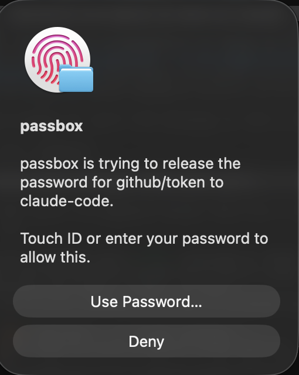

# passbox

A password store for machines that run agents. An agent asks for a secret, macOS
raises a Touch ID prompt naming the agent and the secret, and the value goes into
one child process rather than into the agent.

<p align="center">
  
</p>

That prompt is the product. It names the secret and the agent, so approving is a
decision rather than a reflex.

Secrets are ordinary [age](https://age-encryption.org) files. The broker that
decides who may open them is the part that matters. See [docs/DESIGN.md](docs/DESIGN.md)
for why it is built this way and what it costs.

Runs with no Apple Developer Program membership.

## Install

```bash
brew install gabrielkoerich/tap/passbox
passbox init
```

`init` binds the store to this Mac's Secure Enclave and asks for nothing else.
There is no passphrase, so there is no file anyone can carry off and grind at.

The cost is plain: the store opens on this Mac only. Lose it and the secrets are
gone. Turning on sync is what adds a way back, and it is off until you ask.

## Use

```bash
printf 'ghp_xxx' | passbox add github/token
passbox ls
passbox get github/token
```

### Giving a secret to an agent

The value goes into one child process and never into the agent.

```bash
passbox exec --env GITHUB_TOKEN=github/token -- gh api /user
passbox exec --stdin db/password -- psql
```

Prefer `--stdin` where the tool accepts it. Any process running as you can read a
child's environment with `ps eww`.

Set `PASSBOX_AGENT` so the prompt names the caller.

```bash
PASSBOX_AGENT=claude-code passbox exec --env GH_TOKEN=github/token -- gh pr list
```

The prompt then reads `passbox is trying to release the password for
github/token to claude-code.` macOS writes the opening clause from the binary
name, and passbox writes the rest.

### Through MCP

```bash
claude mcp add passbox -- passbox mcp
```

The server exposes two tools, and neither returns a secret.

| Tool | Returns |
|---|---|
| `list_secrets` | names only |
| `run_with_secret` | the command's output, with the value scrubbed out of it |

There is deliberately no `get_secret`. A tool result lands in the model's context,
where it is logged and sent onward, so the tools run the command for the agent
instead of handing it the value. If the command prints the secret anyway,
passbox replaces it in the output before returning.

The agent name in the prompt comes from the MCP handshake, so it is the client's
own `clientInfo.name` rather than a guess up the process tree.

### Approving a project once

A project declares what it needs in `.passbox.toml`:

```toml
secrets = ["github/token", "npm/token"]
window_secs = 3600
```

The first time an agent working in that directory asks for one of them, passbox
shows a single prompt covering the whole list, and does not ask again for the
window. The default is an hour and the cap is twelve.

**The file is a request, not a grant.** An agent can write one itself, so nothing
is approved until you put your finger on the sensor. The approval is bound to the
file's SHA-256: add a secret to the list and the hash changes, so it asks again.
A secret set to `never` is refused no matter what the manifest says.

The project is the caller's working directory, read from the kernel rather than
taken from the request, so a caller cannot point at a manifest somewhere else.
Grants live in `grants-<host>.age`, encrypted, and never sync.

### Permission modes

Every secret carries one.

| Mode | Behaviour |
|---|---|
| `open` | No prompt, for a token an agent reads all day |
| `window` | One prompt per agent and secret per window, the default |
| `always` | A prompt on every read |
| `never` | Never released to an agent, interactive `get` only |

```bash
passbox mode banking/login never
passbox add github/token --mode window --window 600
```

A new value never widens access. Adding over an existing secret keeps the mode it
already had unless you pass `--mode`.

### Seeing what was released

```bash
passbox audit --tail 50
```

Every decision is logged, encrypted, one record per line.

## Backup, with no key anywhere

git carries the encrypted secrets and nothing that opens them.

```bash
passbox git init
passbox git remote add origin git@github.com:you/passbox-store.git
passbox git add -A && passbox git commit -m backup && passbox git push
```

The Secure Enclave wraps are excluded, so the remote holds opaque age files that
only this Mac can read. That protects you from deleting a secret by accident. It
does **not** protect you from losing the Mac, because nothing in the backup can
open it. For that, turn on sync.

## Sync

Sync is off, and nothing leaves the Mac until you run `passbox sync` yourself.
There is no timer and no syncing on write. Turning it on creates a recovery
passphrase, because a second machine has no other way to open the copy.

```bash
passbox sync --enable
passbox sync
```

Understand what that passphrase is. It wraps the store key into
`wraps/recovery.age`, which then travels with the store, so anyone who obtains
the synced copy can attack it offline. It is the one file worth attacking.
Use a long one. passbox asks for at least 12 characters and a diceware phrase is
better.

The default target is the iCloud Drive folder, which is an ordinary directory on
macOS. No account, no rclone, no network code.

```bash
PASSBOX_REMOTE=~/Dropbox/passbox passbox sync   # any directory
PASSBOX_REMOTE=b2:passbox passbox sync          # any rclone remote
```

A remote containing a colon goes through `rclone bisync`, which covers every
backend rclone supports. Nobody on the default path needs rclone installed.

If the store directory is also a git repo, `passbox sync` commits and pushes after
the copy, which gives you history and an off-site remote. Commit subjects are
generic, since a subject naming an entry would undo the encrypted names.

On a second Mac, pull the store and then bind it.

```bash
passbox sync
passbox machine add
```

## Recovering

Every write keeps the last 5 versions, and `rm` keeps the file too.

```bash
passbox restore github/token            # list versions
passbox restore github/token --index 0  # put the newest one back
```

## What is on disk

```text
~/.passbox/
  store/<random-id>.age     one self describing secret per file
  store/<random-id>.tomb    deletion marker
  store/.versions/<id>/     earlier versions, kept local
  wraps/recipient           the store public key, no secret in it
  wraps/recovery.age        the store key under your passphrase, only once sync is on
  wraps/se-<host>.json      the store key under that Mac's Secure Enclave
  audit-<host>.log          one encrypted record per line
  broker.sock               the approval socket
```

The filename is a random id. Names live inside the ciphertext, so nothing on disk
says what a secret is called. What still leaks: how many secrets exist, their
sizes, and their modification times.

## Environment

| Variable | Effect |
|---|---|
| `PASSBOX_DIR` | Where the store lives, default `~/.passbox` |
| `PASSBOX_REMOTE` | Where `passbox sync` copies to **once you have turned sync on**, default the iCloud Drive folder |
| `PASSBOX_AGENT` | Name shown in the prompt beside the secret |
| `PASSBOX_PASSPHRASE` | Supplies the passphrase for CI and headless use, and turns off the Enclave path |

## Building

```bash
cargo test
cargo test -- --ignored   # the Secure Enclave round trip, needs a finger
```

`build.rs` compiles the Swift helper with `swiftc` from the Command Line Tools.

## Compared with pass

passbox exists because of the first two rows. It is not a replacement for
[pass](https://www.passwordstore.org) in the rows below them.

| | `pass` | passbox |
|---|---|---|
| Private key at rest | a portable file under a passphrase, attackable offline | sealed to the Secure Enclave, inert on any other machine |
| Entry names | plaintext filenames, and in git commit subjects | inside the ciphertext |
| Authorisation | one GPG passphrase, then the agent caches it | per agent and per secret, with modes and windows |
| Who asked for it | unknowable | named in the prompt and in the audit log |
| Giving one to an agent | prints to stdout | injected into one child, and scrubbed from its output |
| Maturity | a decade old, packaged everywhere | young, unreviewed |
| Platforms | anywhere GPG runs | macOS only |
| Ecosystem | browser, mobile, dmenu, otp, import | none |
| Losing the machine | keys are portable and backed up by design | the store is gone unless sync is on |
| Reading the source | 721 lines of shell | 2,900 lines of Rust and Swift, plus a daemon |

Use passbox for the secrets your agents touch, where a prompt naming the caller
is the whole point. Keep pass for the ones you cannot afford to lose, until this
has had outside eyes on it.

## What this has and has not been checked against

The parts that came from elsewhere carry other people's review. age and scrypt
come from the `age` crate. The Secure Enclave, HKDF and AES-GCM come from
CryptoKit. The hardware guarantee is Apple's.

What is ours is the composition, and these are the checks on it:

- A second implementation, Python's `cryptography`, opens what CryptoKit sealed.
  Two libraries agreeing is the evidence the construction is standard rather than
  something invented here. It also checks that a stranger's key, a flipped tag
  byte and a swapped ephemeral key are all refused, and that no ephemeral key
  repeats. Run it with `tests/ecies.py`.
- The reference `age` CLI opens the secret files, so the store is standard age
  and stays readable with off the shelf tools if passbox goes away.
- Tampered and truncated files are refused: secrets, the recovery wrap, audit
  records, and grants, which fail closed to no grants at all.
- The base64 the helper is fed matches the RFC 4648 vectors.

## Disclaimer

This is not proven and it is not fault proof.

It is young, and no independent security review has happened yet.
Cross-implementation tests raise confidence. They do not replace an audit, and
nothing above is a proof of security.

Use it for the secrets your agents reach for. Keep another copy of anything you
cannot afford to lose. Findings are welcome.

## Licence

MIT
