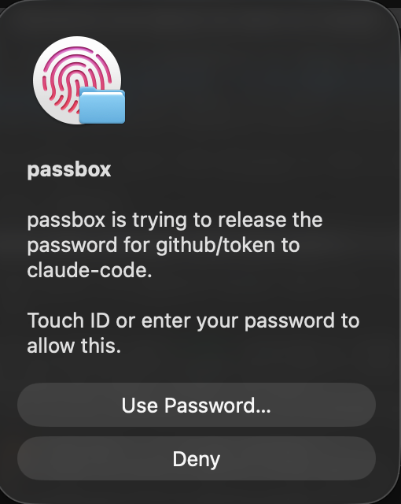

# passbox

A password store for machines that run agents. An agent asks for a secret, macOS
raises a Touch ID prompt naming the agent and the secret, and the value goes into
one child process rather than into the agent.

<p align="center">
  
</p>

Secrets are ordinary [age](https://age-encryption.org) files. The broker decides
who may open them. See [docs/content/design.md](docs/content/design.md) for why it is built this
way and what it costs.

Runs with no Apple Developer Program membership.

## Install

```bash
brew install gabrielkoerich/tap/passbox
passbox init
```

Recent Homebrew asks you to trust a third party tap before it will build from
one. If the install stops and says so, run `brew trust --formula
gabrielkoerich/tap/passbox` and try again.

That downloads a prebuilt binary. Nothing is compiled, so Rust is not needed.
Building from source, with `--build-from-source` or `--HEAD`, needs Rust and the
Command Line Tools for `swiftc`. A full Xcode is not needed either way.

### On Linux

Take the binary from a [release](https://github.com/gabrielkoerich/passbox/releases):

```bash
curl -sSfL -o passbox.tar.gz \
  https://github.com/gabrielkoerich/passbox/releases/latest/download/passbox-x86_64-unknown-linux-musl.tar.gz
tar -xzf passbox.tar.gz && sudo install passbox /usr/local/bin/
```

That binary is statically linked against musl, so it runs on any distribution regardless of its
glibc. It is the client build: no Secure Enclave, no broker and no `sync`, so it opens a store
with a passphrase rather than a fingerprint. Asking a Mac to approve a read is designed, not built.
See [Known limits](docs/content/design.md#known-limits).

`init` binds the store to this Mac's Secure Enclave and asks for nothing else.
There is no passphrase, so there is no file anyone can carry off and grind at.

The cost is plain: the store opens on this Mac only. Lose it and the secrets are
gone. Turning on sync is what adds a way back, and it is off until you ask.

## Use

```bash
printf 'ghp_xxx' | passbox add github/token
passbox ls
passbox get github/token
```

### Coming from pass

```bash
passbox import-pass              # everything
passbox import-pass bean         # one namespace
passbox import-pass bean/token   # one entry
```

Each entry is decrypted through GPG and re-encrypted to the store key. The whole
body is kept, so the `key: value` lines many pass entries carry under the
password survive. Entries already in the store are skipped unless you pass
`--force`, and nothing in `pass` is changed or removed.

### Giving a secret to an agent

The value goes into one child process and never into the agent.

```bash
passbox exec --env GITHUB_TOKEN=github/token -- gh api /user
passbox exec --stdin db/password -- psql
```

Prefer `--stdin` where the tool accepts it. Any process running as you can read a
child's environment with `ps eww`.

Set `PASSBOX_AGENT` so the prompt names the caller.

```bash
PASSBOX_AGENT=claude-code passbox exec --env GH_TOKEN=github/token -- gh pr list
```

The prompt then reads `passbox is trying to release the password for
github/token to claude-code.` macOS writes the opening clause from the binary
name, and passbox writes the rest.

### Through MCP

An agent asks through tools rather than a shell, and the tools cannot hand it a value at all.

```bash
claude mcp add passbox -- passbox mcp          # Claude Code
codex mcp add passbox -- passbox mcp           # Codex
```

Any client that speaks MCP over stdio works, and the command is always `passbox mcp`. For one
configured by file:

```json
{
  "mcpServers": {
    "passbox": { "command": "passbox", "args": ["mcp"] }
  }
}
```

That file is `~/.claude.json` for Claude Code, `~/.codex/config.toml` for Codex in TOML form,
and `~/.cursor/mcp.json` for Cursor. Check it took with `claude mcp list`.

The server exposes two tools, and neither returns a secret.

| Tool | Returns |
|---|---|
| `list_secrets` | names only |
| `run_with_secret` | the command's output, with the value scrubbed out of it |

There is deliberately no `get_secret`. A tool result lands in the model's context,
where it is logged and sent onward, so the tools run the command for the agent
instead of handing it the value. If the command prints the secret anyway,
passbox replaces it in the output before returning.

The agent name in the prompt comes from the MCP handshake, so it is the client's
own `clientInfo.name` rather than a guess up the process tree.

### Approving a project once

A project declares what it needs in `.passbox.toml`:

```toml
secrets = ["github/token", "npm/token"]
window_secs = 3600
```

The first time an agent working in that directory asks for one of them, passbox
shows a single prompt covering the whole list, and does not ask again for the
window. The default is an hour and the cap is twelve.

**The file is a request, not a grant.** An agent can write one itself, so nothing
is approved until you put your finger on the sensor. The approval is bound to the
file's SHA-256: add a secret to the list and the hash changes, so it asks again.
A secret set to `never` is refused no matter what the manifest says.

The project is the caller's working directory, read from the kernel rather than
taken from the request, so a caller cannot point at a manifest somewhere else.
Grants live in `grants-<host>.age`, encrypted, and never sync.

### Permission modes

Every secret carries one.

| Mode | Behaviour |
|---|---|
| `open` | No prompt, for a token an agent reads all day |
| `window` | One prompt per agent and secret per window, the default |
| `always` | A prompt on every read |
| `never` | Never released to an agent, interactive `get` only |

```bash
passbox mode banking/login never
passbox add github/token --mode window --window 600
```

A new value never widens access. Adding over an existing secret keeps the mode it
already had unless you pass `--mode`.

### Seeing what was released

```bash
passbox audit --tail 50
```

Every decision is logged, encrypted, one record per line.

## Backup and sync

git carries the encrypted secrets and nothing that opens them.

```bash
passbox git init
passbox git remote add origin git@github.com:you/passbox-store.git
passbox git add -A && passbox git commit -m backup && passbox git push
```

The Secure Enclave wraps are excluded, so the remote holds opaque age files that
only this Mac can read. That protects you from deleting a secret by accident. It
does **not** protect you from losing the Mac, because nothing in the backup can
open it. For that, turn on sync.

### Sync

Sync is off, and nothing leaves the Mac until you run `passbox sync` yourself.
There is no timer and no syncing on write.

```bash
passbox sync --enable
passbox sync
```

`--enable` asks two questions.

The first is how a second machine gets in, a YubiKey or a passphrase. See [If you
lose the Mac](#if-you-lose-the-mac).

The second is where the copy goes:

```
Where should the copy go?

  1) iCloud Drive, a folder on this Mac that Apple replicates
  2) A directory you name, such as a USB stick or Dropbox
  3) A git remote, which also gives you history
  4) An rclone remote, for S3, B2, Drive and the rest
```

The answer is written to `~/.passbox/remote`, so later runs of bare `passbox sync`
go to the same place. Running `--enable` again shows the current destination and
offers to change it. `PASSBOX_REMOTE` overrides one run without changing the file.

| Answer | Goes to | Needs |
|---|---|---|
| iCloud Drive | `~/Library/Mobile Documents/com~apple~CloudDocs/passbox` | nothing |
| a directory | wherever you say | nothing |
| a git remote | `~/.passbox` made a repo, pushed on each sync | `git` |
| an rclone remote | any of rclone's backends | `rclone` |

iCloud Drive is an ordinary directory on macOS, so the default path is a directory
to directory copy. No account, no rclone, no network code.

passbox tells them apart by shape. A remote starting `git@`, `ssh://` or `https://`,
or ending `.git`, is git. One starting `/`, `~` or `.` is a directory. Anything else
holding a colon goes to `rclone bisync`. The rest is a directory.

Git commits after the copy, which gives you history and an off-site remote. Commit
subjects are generic, since a subject naming an entry would undo the encrypted
names.

On a second Mac, `passbox sync` then `passbox machine add`, the same steps as
recovering onto a replacement.

### If you lose the Mac

By default there is no way back. `init` binds the store to this Mac's Secure
Enclave and writes no other wrap, so the key exists in one place and cannot
leave it.

**Time Machine does not help.** It copies `wraps/se-<host>.json` faithfully, and
the file is inert anywhere else. The private half never leaves the Enclave.
Erasing the Mac destroys the Enclave keys, so a restore onto a wiped machine
finds files it cannot open. Only a restore to the same Mac, not erased, still
works.

To have a way back, turn on sync. It asks how the copy should be opened, writes
that wrap, then asks where the copy goes.

```bash
passbox sync --enable
```

```
That copy needs a way in. Two choices:

  1) A YubiKey. Nothing in the copy can be attacked, and you keep the token.
  2) A passphrase. Works anywhere, and anyone holding the copy can grind it.
```

Choosing the token handles the rest: it offers to install `age-plugin-yubikey`,
and asks before provisioning a slot, because that changes the hardware.

Pick the passphrase knowing the cost. Anyone holding the copy can attack that wrap
offline at their own pace. passbox refuses a passphrase under 12 characters. Use
five or six diceware words.

A wrap only helps where the copy reaches. A USB stick in the same bag as the Mac
survives neither a fire nor a theft.

### A YubiKey instead of a passphrase

A passphrase wrap is the one file in a synced copy worth attacking. A YubiKey
wrap has nothing to grind, because the private half stays in the token.

`passbox sync --enable` does the whole setup, so the commands below are only for
adding a token to a store that already syncs.

```bash
passbox yubikey-add age1yubikey1...    # the recipient from --list
```

### A YubiKey on firmware 5.7 needs one command first

Firmware 5.7 sets the PIV management key algorithm to **AES192**, and
`age-plugin-yubikey` supports TDES only, so a brand new token fails. A factory
reset does not help, because the reset sets AES192 too.

```bash
ykman piv info | grep "Management key algorithm"   # AES192 means read on
ykman piv access change-management-key -a tdes \
  -n 010203040506070801020304050607080102030405060708
```

passbox checks this before it asks the plugin for anything, so it says which
algorithm is set and what to run rather than failing inside the plugin. The
symptom without the check is an error naming neither the cause nor the fix, and
on a half-finished attempt a private key is left in a PIV slot with no
certificate. `ykman piv keys delete <slot>` clears that.

This touches the PIV applet only. OpenPGP is a separate applet on the same chip,
so PGP keys and their PIN are unaffected.

The copy in iCloud is then inert without the token in your hand. Touch ID stays
the daily path on this Mac; the token is only for recovery. `machine add` uses it
when the wrap is there, and falls back to the passphrase otherwise.

| | passphrase wrap | YubiKey wrap |
|---|---|---|
| A stolen copy | can be ground offline | is useless |
| You must keep | the phrase | the token |
| Recovery needs | the phrase | the token and `age-plugin-yubikey` |

Enrol a second token. age takes any number of recipients, so `yubikey-add` adds
to the same wrap rather than replacing it, and either token then opens the store.

```bash
passbox yubikey-add age1yubikey1...   # the second one
```

Recipients are public keys, so they sit in the clear in `wraps/yubikey.recipients`.

passbox uses the **PIV** applet. OpenPGP keys live in a separate applet on the
same chip and are never touched. Before provisioning a slot it reads what PIV
already holds and shows you, using `ykman` when it is installed.

### When the YubiKey will not cooperate

Four failures, each with an error naming neither the cause nor the fix. In the order you are
likely to meet them.

**`Failed to authenticate with the PIN-protected management key`**

Firmware 5.7 sets the PIV management key algorithm to **AES192**, and `age-plugin-yubikey`
supports TDES only. A factory reset does not help, because the reset sets AES192 too, so a
brand new token arrives in this state.

```bash
ykman piv info | grep "Management key algorithm"   # AES192 means read on
ykman piv access change-management-key -a tdes \
  -n 010203040506070801020304050607080102030405060708
```

passbox checks this before it asks the plugin for anything, so it says which algorithm is set
rather than failing inside the plugin.

**`Error while communicating with YubiKey: authentication error`, after the touch**

GPG's `scdaemon` opens the smart card exclusively and holds it. It lands between the plugin's
key generation and its certificate write, and the write comes back as an authentication error.
Anything that calls `pass` starts it again, including a scheduled job, so it can reappear
mid-operation.

```bash
gpgconf --kill scdaemon
```

passbox offers to do this before generating. If something on a timer keeps restarting it, stop
that first.

**The touch never registers**

On a 5C Nano the contact sits flush in the port and is hard to reach. The plugin waits, gets
nothing, and reports it as an authentication error.

```bash
age-plugin-yubikey --generate --touch-policy never
```

For a Nano that is the right setting rather than a workaround: the form factor exists to live
in a port permanently. The PIN still applies, so a stolen token is useless without it.

**A prompt appears and the PIN is refused**

If generation failed *after* the plugin's PIN-change step, your PIN is already the new one even
though nothing was provisioned. Retrying with the old PIN burns attempts, and three wrong tries
locks the applet. Check `ykman piv info` for `PIN tries remaining` before retrying, and reset
rather than guess:

```bash
ykman piv reset       # needs no PIN, wipes the PIV applet only
```

A reset leaves your OpenPGP keys and their PIN untouched. They are a separate applet on the
same chip. Remember to set TDES again afterwards.

**A half-provisioned slot**

A failed generation can leave a private key with no certificate. `ykman piv info` shows the
slot; `ykman piv keys delete <slot>` clears it, or `ykman piv reset` clears everything.

### Recovering on a replacement Mac

```bash
brew install gabrielkoerich/tap/passbox
cp -R ~/Library/Mobile\ Documents/com~apple~CloudDocs/passbox ~/.passbox
passbox machine add
```

`machine add` asks the recovery passphrase, then binds the new Mac's Enclave, so
reads go back to asking for a fingerprint.

Rejected: backing up the Enclave key itself. It cannot be exported, which is the
property that makes a stolen copy of the store useless.

## Unattended

A daemon cannot answer a fingerprint prompt at 3am, so the goal is that it never has to read
passbox at all after it starts.

### Inject at launch, and stop reading

The first thing to reach for. One approval, and the value lands in the process environment
where every child inherits it:

```bash
passbox exec --env GITHUB_TOKEN=github/token -- ./your-daemon
```

Nothing shells out to passbox again for the life of that process, so it runs for weeks on one
fingerprint and needs you only when you restart it. This works with no code change wherever a
credential layer already prefers an environment variable over its providers.

Cost: the value sits in the environment for the process's lifetime, and anything running as you
can read it with `ps eww`. Use `--stdin` where the child takes a secret that way.

### A grant, for what cannot be injected

Some secrets have no usable variable name, and some jobs pick what they read at runtime. For
those, one approval mints a **token** that opens exactly the secrets it was granted, to whoever
holds it, until it lapses:

```bash
export PASSBOX_TOKEN=$(passbox grant bean/hl-mainnet-pk bean/hyperliquid-address --for 86400)
```

The token goes to stdout and the covered names to stderr, so `$(...)` captures the token alone.
Reads that present it are audited as `by token`.

**A namespace is refused.** `grant bean` would hand over everything under it to save one prompt,
and it scopes on how the store happens to be laid out rather than on what the job reads: put
everything at the root and a namespace rule protects nothing.

```bash
passbox grant bean
passbox: bean is a namespace holding 21 secrets, ask for the ones this needs:
  bean/coinmarketcap-api-key
  bean/hl-mainnet-pk
  ...
```

The refusal lists them, so naming them is a copy rather than a chore, and it costs no
fingerprint: the names come from the local index before the broker is involved.

**24 hours is the ceiling** and it cannot be raised. A token that never lapses is a password
with extra steps. Something that must run untended indefinitely wants injection, not a token.

Restarting the broker tears up every outstanding token:

```bash
pkill -f "passbox broker"
```

### Mint once per process

A token caches on the client that minted it. A factory that builds a fresh client per call
mints a fresh grant per call, and each one is a fingerprint. Memoise it. The symptom is
repeated `approved` for one secret and one agent in `passbox audit`.

## Another machine

A Linux box with no Secure Enclave can read a secret held by a Mac. The fingerprint happens on
the Mac; the client holds no store and no key, so a copy of it is worth nothing.

Verified from a Raspberry Pi on a LAN and a fly.io machine in another country, both over
Tailscale.

### On the Mac

The broker has to be **already running, in your login session**. One started by an incoming
connection cannot raise a Touch ID prompt: whoever calls `evaluatePolicy` has to be somewhere a
sensor is reachable. A LaunchAgent is how you get that.

`~/Library/LaunchAgents/com.you.passbox.broker.plist`:

```xml
<?xml version="1.0" encoding="UTF-8"?>
<!DOCTYPE plist PUBLIC "-//Apple//DTD PLIST 1.0//EN" "http://www.apple.com/DTDs/PropertyList-1.0.dtd">
<plist version="1.0">
<dict>
  <key>Label</key><string>com.you.passbox.broker</string>
  <key>ProgramArguments</key>
  <array>
    <string>/opt/homebrew/bin/passbox</string>
    <string>broker</string>
  </array>
  <key>EnvironmentVariables</key>
  <dict>
    <key>PATH</key><string>/usr/local/bin:/opt/homebrew/bin:/usr/bin:/bin</string>
  </dict>
  <key>RunAtLoad</key><true/>
  <key>KeepAlive</key><true/>
  <key>StandardErrorPath</key><string>/tmp/passbox-broker.log</string>
</dict>
</plist>
```

`PATH` is not decoration. A LaunchAgent gets a minimal one, `tailscale` is not on it, and the
broker then starts with no tailnet listener and says nothing about why.

```bash
launchctl bootstrap gui/$(id -u) ~/Library/LaunchAgents/com.you.passbox.broker.plist
tailscale serve --bg --tcp 8787 tcp://127.0.0.1:8787
```

### Why `serve` rather than binding the tailnet address

The broker binds `127.0.0.1:8787` and Tailscale forwards to it. Binding the 100.x address
directly looks right and does not work: macOS runs Tailscale as a network extension, the socket
accepts the connection, and the first read fails with `ENOTCONN`. Measured 2026-09-27, and
reproduced with a plain Python server, so it is the platform rather than passbox.

Cost: loopback has none of the unix socket's `0600` protection, so any local user can reach that
port. It is the only inbound path macOS actually delivers.

### On the client

```bash
curl -fsSL -o passbox.tar.gz \
  https://github.com/gabrielkoerich/passbox/releases/latest/download/passbox-x86_64-unknown-linux-musl.tar.gz
tar -xzf passbox.tar.gz && sudo install passbox /usr/local/bin/

echo "100.x.y.z" > ~/.passbox/host      # the Mac's tailnet address, or its MagicDNS name
passbox get github/token
```

`PASSBOX_HOST` does the same for one run. A configured host wins over anything on the client's
own disk, so a machine with no store still asks the Mac rather than falling back to a passphrase
it does not have.

### In a container

[`examples/linux-client`](examples/linux-client) has a Dockerfile with Tailscale and the client,
and a fly.io deployment that was used to verify this.

```bash
fly launch --no-deploy --name passbox-poc
fly secrets set TS_AUTHKEY=tskey-auth-... PASSBOX_HOST=100.x.y.z
fly deploy --ha=false
fly ssh console -C "passbox get github/token"
```

Give the container a real tun device. `tailscaled --tun=userspace-networking` reaches the
tailnet only through a SOCKS proxy, so an ordinary `connect()` to a 100.x address times out with
no hint why. The entrypoint uses `/dev/net/tun` when the platform provides one.

### What this does not give you

**No listing.** `ls` needs the names, which needs the store key, which stays on the Mac. Ask for
a name you know.

**The caller is not identified.** The broker runs `tailscale whois` on the peer, which the
control plane authenticates, but traffic arriving through `serve` has a loopback peer address,
so it resolves to nothing and the prompt says `an unidentified tailnet peer`. `PASSBOX_AGENT` is
still whatever the caller claims.

**The Mac must be awake, unlocked, and its lid open.** Nothing can answer a prompt otherwise,
and a closed lid fails with `canEvaluatePolicy` false rather than anything clearer.

**Nobody is there at 3am.** A scheduled job wants injection or a
grant, not a prompt. See [Unattended](README.md#unattended).

## Reference

### Undoing a change

Every write keeps the last 5 versions, and `rm` keeps the file too.

```bash
passbox restore github/token            # list versions
passbox restore github/token --index 0  # put the newest one back
```

### What is on disk

```text
~/.passbox/
  store/<random-id>.age     one self describing secret per file
  store/<random-id>.tomb    deletion marker
  store/.versions/<id>/     earlier versions, kept local
  wraps/recipient           the store public key, no secret in it
  wraps/recovery.age        the store key under your passphrase, only once sync is on
  wraps/se-<host>.json      the store key under that Mac's Secure Enclave
  audit-<host>.log          one encrypted record per line
  broker.sock               the approval socket
```

The filename is a random id. Names live inside the ciphertext, so nothing on disk
says what a secret is called. What still leaks: how many secrets exist, their
sizes, and their modification times.

### Environment

| Variable | Effect |
|---|---|
| `PASSBOX_DIR` | Where the store lives, default `~/.passbox` |
| `PASSBOX_REMOTE` | Overrides the destination for one run, ahead of the one `sync --enable` recorded |
| `PASSBOX_AGENT` | Name shown in the prompt beside the secret |
| `PASSBOX_PASSPHRASE` | Supplies the passphrase for CI and headless use, and turns off the Enclave path |

### Building

```bash
cargo test
cargo test -- --ignored   # the Secure Enclave round trip, needs a finger
```

`build.rs` compiles the Swift helper with `swiftc` from the Command Line Tools.

### Listing names without unlocking

`ls` used to decrypt every entry to learn the names, which meant a prompt and a store key warm
in the broker afterwards. That is the largest privilege there is for the smallest question.

A plaintext list of names now lives at `~/.passbox/names`, written as the store changes, so `ls`
answers with no key and no prompt. `get` is unaffected and still needs one.

The cost, stated plainly: that one file names what you hold. It never leaves the machine. Sync
skips it, a store that is a git repo ignores it, and it is `0600`, so a copy elsewhere still says
nothing about you. Someone with this disk but not the Enclave learns what you have, not what it
is.

A sync that pulls deletes the list, because a pull can bring names this machine has never
decrypted. The next `ls` rebuilds it with one prompt.

### Fields in one entry

An entry can hold more than a password. The first line is the secret, later `key: value` lines
are fields, which is the layout `pass` uses and `import-pass` keeps.

```bash
passbox get db/prod                  # the whole thing
passbox get db/prod --field username # just that one
```

Reading one field hands a caller the password without the note beside it.

## About

### Using it from a program

[`examples/`](examples) holds a [Python](examples/python) and a [Rust](examples/rust) client,
each with a runnable self-check. The same shape works in any language: shell out to
`passbox exec` to hand a secret to a child process, and mint one grant per process rather than
one per read.

For agents specifically, see [AGENTS.md](AGENTS.md), and the skill in
[`skills/passbox`](skills/passbox) that teaches a coding agent to use passbox correctly.

### Compared with pass

passbox exists because of the first two rows. It is not a replacement for
[pass](https://www.passwordstore.org) in the rows below them.

| | `pass` | passbox |
|---|---|---|
| Private key at rest | a portable file under a passphrase, attackable offline | sealed to the Secure Enclave, inert on any other machine |
| Entry names | plaintext filenames, and in git commit subjects | inside the ciphertext |
| Authorisation | one GPG passphrase, then the agent caches it | per agent and per secret, with modes and windows |
| Who asked for it | unknowable | named in the prompt and in the audit log |
| Giving one to an agent | prints to stdout | injected into one child, and scrubbed from its output |
| Maturity | a decade old, packaged everywhere | young, unreviewed |
| Platforms | anywhere GPG runs | macOS, with a passphrase-only client on Linux |
| Ecosystem | browser, mobile, dmenu, otp, import | none |
| Losing the machine | keys are portable and backed up by design | the store is gone unless sync is on, then a passphrase or a YubiKey opens it |
| Reading the source | 721 lines of shell | 3,079 lines of Rust and Swift, plus a daemon |

Use passbox for the secrets your agents touch. Keep pass for the ones you cannot
afford to lose, until this has had outside eyes on it.

### What this has and has not been checked against

The parts that came from elsewhere carry other people's review. age and scrypt
come from the `age` crate. The Secure Enclave, HKDF and AES-GCM come from
CryptoKit. The hardware guarantee is Apple's.

What is ours is the composition, and these are the checks on it:

- A second implementation, Python's `cryptography`, opens what CryptoKit sealed.
  Two libraries agreeing is the evidence the construction is standard rather than
  something invented here. It also checks that a stranger's key, a flipped tag
  byte and a swapped ephemeral key are all refused, and that no ephemeral key
  repeats. Run it with `tests/ecies.py`.
- The reference `age` CLI opens the secret files, so the store is standard age
  and stays readable with off the shelf tools if passbox goes away.
- Tampered and truncated files are refused: secrets, the recovery wrap, audit
  records, and grants, which fail closed to no grants at all.
- The base64 the helper is fed matches the RFC 4648 vectors.

### Disclaimer

This is not proven and it is not fault proof.

It is young, and no independent security review has happened yet.
Cross-implementation tests raise confidence. They do not replace an audit, and
nothing above is a proof of security.

Use it for the secrets your agents reach for. Keep another copy of anything you
cannot afford to lose. Findings are welcome.

### Licence

MIT
